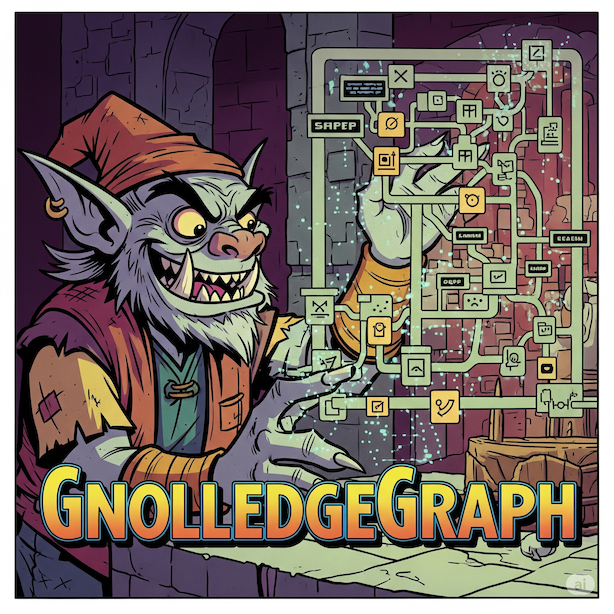

# GnolledgeGraph



An implementation of the MCP (Model Context Protocol) Memory Server specification with a web-based SQLite WASM frontend. This server provides a knowledge graph system supporting entities, relations, and observations with both REST API and MCP protocol access.

## Features

- **Complete MCP Memory Server**: Implements all 9 endpoints from the official MCP memory server specification
- **Dual API Format Support**: Provides both an original Go API (at `/api/`) and a Python FastAPI compatible API (at root paths like `/read_graph`).
- **WASM Frontend**: Interactive web interface with SQLite WASM for local data management (currently interacts with the Go API).
- **Client-Server Sync**: Offline-first architecture with bidirectional database synchronization.
- **MCP STDIO Support**: Full stdin/stdout MCP client integration.
- **Persistent Storage**: SQLite database with IndexedDB persistence in the frontend.
- **Modern Web UI**: Tabbed interface for creating, searching, and deleting knowledge graph data.
- **OpenAPI Documentation**: Comprehensive API specification at `/openapi.json`, covering both Go and Python API formats.

## MCP Memory Server Endpoints

This implementation provides all 9 required MCP memory server tools:

1. **`read_graph`** - Read the entire knowledge graph
2. **`create_entities`** - Create multiple entities with optional initial observations  
3. **`create_relations`** - Create multiple relations between entities
4. **`add_observations`** - Add observations to existing entities
5. **`delete_entities`** - Remove entities and their associated relations (cascading)
6. **`delete_observations`** - Remove specific observations from entities
7. **`delete_relations`** - Remove specific relations from the graph
8. **`search_nodes`** - Search entities by name, type, or observation content
9. **`open_nodes`** - Retrieve specific entities by name with their relations

## Prerequisites

- Go 1.24 or later  
- Git (to clone repository)

## Building

```bash
git clone <your-repo-url>
cd gnolledgegraph
# 1. Compile the frontend WASM application using the build script
go generate ./...

# 2. Build the main server binary (which now includes the WASM)
go build -o knowledge-graph ./cmd/knowledge-graph
```

## Running

### Web Server Mode

```bash
./knowledge-graph --port 8080 --db-path ./kg.db
```

Open your browser at http://127.0.0.1:8080 to access the interactive web interface.

### MCP STDIO Mode

For integration with MCP clients (like Claude Desktop), run in stdio mode, note that this will start up the knowledge-graph and it can already be running

```bash
./knowledge-graph --stdio --db-path ./kg.db
```

## MCP Client Configuration

### Claude Desktop Configuration

Add this server to your Claude Desktop configuration file:

**Windows**: `%APPDATA%/Claude/claude_desktop_config.json`  
**macOS**: `~/Library/Application Support/Claude/claude_desktop_config.json`  
**Linux**: `~/.config/claude/claude_desktop_config.json`

```json
{
  "mcpServers": {
    "knowledge-graph": {
      "command": "/path/to/knowledge-graph",
      "args": ["--stdio", "--db-path", "/path/to/kg.db"]
    }
  }
}
```

### Generic MCP Client

Any MCP client can connect using stdio transport:

```bash
# Start the server in stdio mode
./knowledge-graph --stdio --db-path ./kg.db

# The server will communicate via JSON-RPC over stdin/stdout
```

### Testing MCP Connection

Use the included test script to verify MCP functionality:

```bash
./test-mcp.sh
```

This script demonstrates:
- Server initialization
- Tool discovery (`tools/list`)
- Knowledge graph operations (`create_entities`, `add_observations`, `read_graph`)
- Search functionality (`search_nodes`)

## REST API Endpoints

The server exposes two sets of REST API endpoints:

### Original Go API Endpoints (at `/api/`)

These endpoints follow Go conventions (snake_case, separate observation handling):

- `GET /api/read_graph` - Read complete graph (Go format)
- `POST /api/create_entities` - Create entities (Go format)
- `POST /api/create_relations` - Create relations (Go format)
- `POST /api/add_observations` - Add observations (Go format)
- `DELETE /api/delete_entities` - Delete entities (Go format)
- `DELETE /api/delete_relations` - Delete relations (Go format)
- `DELETE /api/delete_observations` - Delete observations (Go format)
- `GET /api/search_nodes?query=<term>` - Search nodes (Go format)
- `POST /api/open_nodes` - Open specific nodes (Go format)
- `GET /api/export_db` - Download complete SQLite database (binary format)
- `POST /api/import_db` - Upload and replace SQLite database (binary format)

### Python FastAPI Compatibility API Endpoints (at root `/`)

These endpoints are designed for Python FastAPI clients (camelCase, embedded observations):

- `GET /read_graph` - Read complete graph (Python format)
- `POST /create_entities` - Create entities with embedded observations (Python format)
- `POST /create_relations` - Create relations (Python format)
- `POST /add_observations` - Add observations to entities (Python format)
- `POST /search_nodes` - Search nodes (Python format, POST with JSON body)
- `POST /open_nodes` - Retrieve specific nodes by name (Python format)
- `POST /delete_entities` - Delete entities (Python format)
- `POST /delete_observations` - Delete observations (Python format)
- `POST /delete_relations` - Delete relations (Python format)

## Web Interface

The embedded web interface provides a complete knowledge graph management system:

- **Create Tab**: Add entities (with initial observations), relations, and observations
- **Search & View Tab**: Search functionality, open specific nodes, view complete graph
- **Delete Tab**: Remove entities, relations, or observations with confirmation dialogs
- **Import/Export Tab**: Database backup and restore functionality
- **Sync Controls**: Bidirectional synchronization between client and server databases

## Client-Server Synchronization

The application supports true offline-first operation with database synchronization between two independent SQLite instances:

### Architecture
- **Backend Database**: Real SQLite file (`kg.db`) used by the Go server for REST API and MCP operations
- **Frontend Database**: Separate SQLite WASM instance running in the browser with IndexedDB persistence
- **Independent Operation**: Both databases can operate completely independently with the same schema

### Offline Operation
- All operations work completely offline using SQLite WASM in the browser
- Data persists locally in IndexedDB across browser sessions
- No server connection required for day-to-day usage
- Frontend database maintains full functionality without backend

### Sync from Server (Backend → Frontend)
- **Binary Download**: Fetches the complete database as a binary file from the server's `/api/export_db` endpoint.
- **Direct WASM Import**: The downloaded binary data is directly imported into the client-side SQLite WASM instance, replacing its current content.
- **IndexedDB Update**: The newly imported database is then persisted to IndexedDB.
- **Access**: Via frontend "Sync DB from Server (Fetch & Import to WASM & IndexedDB)" button.

### Sync to Server (Frontend → Backend)
- **Binary Export from WASM**: Exports the current client-side SQLite WASM database into a binary format.
- **Binary Upload**: Uploads the exported binary data via `POST /api/import_db` to the server.
- **Complete Replacement**: Replaces the server's SQLite file (`kg.db`) with the uploaded database.
- **Access**: Via frontend "Sync DB to Server (Export from WASM & Upload)" button.

### Usage Patterns
- **Individual Use**: Work offline in browser, sync from server for updates, sync to server for backup
- **Team Collaboration**: Sync from server before work, make changes locally, upload changes after
- **Multi-Device**: Use server as central hub, sync between devices via shared backend database
- **Development**: Backend serves MCP/API clients, frontend provides user-friendly interface

### Technical Notes
- **Binary Transfer for Both Directions**: Both synchronization directions now utilize binary transfer of the SQLite database. Backend → Frontend uses `/api/export_db` (download), and Frontend → Backend uses `/api/import_db` (upload).
- **WASM SQLite Compatibility**: This relies on the `ncruces/go-sqlite3` WASM driver's ability to correctly import and export standard SQLite database files.
- **Data Integrity**: Both sync directions preserve all entities, relations, and observations with proper foreign key relationships.

## Testing

Run the comprehensive test suite:

```bash
# Run all tests
go test ./...

# Run tests with verbose output
go test -v ./...

# Run specific package tests
go test ./internal/db
go test ./internal/api

# Run tests with coverage
go test -cover ./...
```

### Test Coverage

- **Database Layer (`internal/db/`)**: All 9 MCP operations, foreign key constraints, search functionality
- **API Layer (`internal/api/`)**: REST endpoints, error handling, data validation
- **MCP Layer (`internal/mcp/`)**: JSON-RPC protocol, tool discovery, method dispatch

## Project Structure

```
.
├── build.go                 # NEW: Cross-platform build script for WASM
├── cmd/
│   ├── frontend/            # NEW: Go source for the WASM frontend
│   │   └── main.go
│   └── knowledge-graph/
│       ├── main.go          # Entry point with go:generate directive
│       └── web/             # Static assets (embedded in binary)
│           ├── index.html
│           ├── wasm_exec.js
│           └── main.wasm    # <-- This is now generated automatically
├── internal/
│   ├── api/                 # API handlers and definitions
│   ├── db/                  # Database layer
│   └── mcp/                 # MCP protocol implementation
├── go.mod
└── go.sum
```

## Database Schema

The SQLite database uses three tables with foreign key constraints:

```sql
-- Entities with unique names
CREATE TABLE entities (
    name TEXT PRIMARY KEY,
    entity_type TEXT NOT NULL
);

-- Relations between entities
CREATE TABLE relations (
    id INTEGER PRIMARY KEY AUTOINCREMENT,
    from_entity TEXT NOT NULL,
    to_entity TEXT NOT NULL,
    relation_type TEXT NOT NULL,
    FOREIGN KEY(from_entity) REFERENCES entities(name) ON DELETE CASCADE,
    FOREIGN KEY(to_entity) REFERENCES entities(name) ON DELETE CASCADE
);

-- Observations linked to entities
CREATE TABLE observations (
    id INTEGER PRIMARY KEY AUTOINCREMENT,
    entity_name TEXT NOT NULL,
    content TEXT NOT NULL,
    FOREIGN KEY(entity_name) REFERENCES entities(name) ON DELETE CASCADE
);
```

## Implementation Status

- ✅ **Complete MCP Memory Server**: All 9 endpoints implemented per specification
- ✅ **STDIO Protocol Support**: Full MCP client integration capability
- ✅ **Dual REST API Support**: HTTP endpoints for both original Go API and Python FastAPI compatible API.
- ✅ **Interactive Web Interface**: Tabbed UI with WASM SQLite persistence (currently uses Go API).
- ✅ **Comprehensive Testing**: Unit and integration tests for all layers
- ✅ **OpenAPI Documentation**: Complete API specification
- ✅ **Foreign Key Constraints**: Data integrity with cascading operations
- ✅ **Search Functionality**: Full-text search across entities, types, and observations
- ✅ **Error Handling**: Detailed error messages and validation
- ✅ **Client-Server Sync**: Offline-first with bidirectional database synchronization

## Usage Examples

### Creating Knowledge via MCP

```bash
# Create entities
echo '{"jsonrpc":"2.0","id":1,"method":"tools/call","params":{"name":"create_entities","arguments":{"entities":[{"name":"Python","entityType":"ProgrammingLanguage","observations":["High-level language","Interpreted"]}]}}}' | ./knowledge-graph --stdio

# Add relations  
echo '{"jsonrpc":"2.0","id":2,"method":"tools/call","params":{"name":"create_relations","arguments":{"relations":[{"from":"Python","to":"Django","relationType":"hasFramework"}]}}}' | ./knowledge-graph --stdio

# Search the graph
echo '{"jsonrpc":"2.0","id":3,"method":"tools/call","params":{"name":"search_nodes","arguments":{"query":"programming"}}}' | ./knowledge-graph --stdio
```

### REST API Usage

**Using the Go API (e.g., for existing integrations):**
```bash
# Read the complete graph (Go format)
curl http://localhost:8080/api/read_graph

# Search for nodes (Go API)
curl "http://localhost:8080/api/search_nodes?query=python"

# Create new entities (Go API)
curl -X POST http://localhost:8080/api/create_entities \
  -H "Content-Type: application/json" \
  -d '{"entities":[{"name":"Rust","entity_type":"ProgrammingLanguage"}]}'
```

**Using the Python Compatibility API (e.g., for new Python clients):**
```bash
# Create new entities with embedded observations (Python API)
curl -X POST http://localhost:8080/create_entities \
  -H "Content-Type: application/json" \
  -d '{"entities":[{"name":"FastAPI","entityType":"Framework","observations":["Web framework","Python-based"]}]}'

# Read the complete graph (Python format)
curl http://localhost:8080/read_graph
```

**Sync operations (still use Go API endpoints):**
```bash
curl -o backup.db http://localhost:8080/api/export_db  # Download database
curl -X POST -H "Content-Type: application/octet-stream" \
  --data-binary @backup.db http://localhost:8080/api/import_db  # Upload database
```

This implementation provides a complete, production-ready MCP memory server that can be integrated with any MCP-compatible client. It also offers standalone REST API access through two distinct formats (Go-native and Python FastAPI compatible) and a web interface.

## TODO

- [ ] **Streamable HTTP MCP Transport Support**: Implement HTTP-based MCP transport protocol once Claude Desktop/Code adds support for it. This would enable MCP communication over HTTP instead of stdin/stdout, allowing for better integration with web-based clients and potentially improved performance for larger knowledge graphs.
- [ ] **Incremental Sync**: Add support for incremental/delta synchronization to only transfer changed data rather than full database replacement, improving performance for large knowledge graphs.
- [ ] **Conflict Resolution**: Implement merge strategies for handling conflicting changes when syncing between multiple clients that have made simultaneous modifications.
- [ ] **API Consolidation**: Refactor to a single, Python-compatible API, removing the original Go-specific API endpoints (under `/api/`) and associated data structures. This will simplify the codebase and focus on a unified interface for all HTTP clients. The web frontend would also need to be updated to use this consolidated API.
