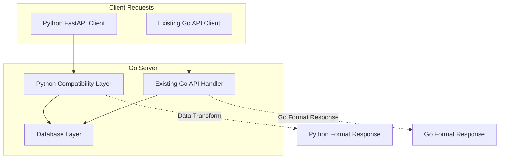

# Python FastAPI Compatibility Layer - Implementation TODO

## 🎯 Project Goal
Create a compatibility layer that allows Python FastAPI clients to work with the Go Knowledge Graph API while preserving backward compatibility with existing Go API clients.

## 📋 Current State Analysis

### Incompatibilities Identified
- **Endpoint Paths**: Python expects root paths (`/create_entities`), Go uses `/api/` prefix
- **Data Structure**: Python embeds observations in entities, Go uses separate normalized tables
- **Field Naming**: Python uses `entityType`/`from`/`to`/`relationType`, Go uses `entity_type`/`from_entity`/`to_entity`/`relation_type`
- **Request Methods**: Python uses `POST /search_nodes`, Go uses `GET /api/search_nodes?query=`
- **Response Formats**: Python returns direct models, Go returns status objects

### Compatibility Matrix
| Operation | Path Compatible | Request Compatible | Response Compatible | Overall |
|-----------|----------------|-------------------|-------------------|---------|
| Read Graph | ❌ | ✅ | ❌ | ❌ |
| Create Entities | ❌ | ⚠️ (partial) | ❌ | ❌ |
| Create Relations | ❌ | ❌ | ❌ | ❌ |
| Add Observations | ❌ | ❌ | ❌ | ❌ |
| Search Nodes | ❌ | ❌ | ❌ | ❌ |
| Delete Operations | ❌ | ⚠️ (partial) | ❌ | ❌ |

**Current Compatibility: 0%**

## 🏗️ Implementation Architecture



## 📝 Implementation Plan

### Phase 1: Foundation - Data Models & Transformations

#### File: `internal/api/transform.go`

**Tasks:**
- [ ] Create Python-compatible data models
  ```go
  type PythonEntity struct {
      Name         string   `json:"name"`
      EntityType   string   `json:"entityType"`
      Observations []string `json:"observations"`
  }
  
  type PythonRelation struct {
      From         string `json:"from"`
      To           string `json:"to"`
      RelationType string `json:"relationType"`
  }
  
  type PythonKnowledgeGraph struct {
      Entities  []PythonEntity   `json:"entities"`
      Relations []PythonRelation `json:"relations"`
  }
  ```

- [ ] Implement transformation functions
  - [ ] `TransformToPython(entities []db.Entity, relations []db.Relation, observations []db.Observation) PythonKnowledgeGraph`
  - [ ] `TransformFromPython(pythonGraph PythonKnowledgeGraph) ([]db.Entity, []db.Relation, []db.Observation)`
  - [ ] `EmbedObservationsInEntities(entities []db.Entity, observations []db.Observation) []PythonEntity`
  - [ ] `ExtractObservationsFromEntities(pythonEntities []PythonEntity) ([]db.Entity, []db.Observation)`

- [ ] Handle field name mapping
  - [ ] `entity_type` ↔ `entityType`
  - [ ] `from_entity` ↔ `from`
  - [ ] `to_entity` ↔ `to`
  - [ ] `relation_type` ↔ `relationType`

#### File: `internal/api/transform_test.go`

**Tasks:**
- [ ] Unit tests for all transformation functions
- [ ] Test data integrity during conversions
- [ ] Test edge cases (empty arrays, missing fields)
- [ ] Performance tests for transformation overhead

### Phase 2: Python Compatibility Endpoints

#### File: `internal/api/python_compat.go`

**Tasks:**

##### Core Handler Setup
- [ ] Create `NewPythonCompatHandler(database *sql.DB) http.Handler`
- [ ] Set up HTTP multiplexer for root path routing
- [ ] Add CORS headers for web client compatibility

##### Endpoint Implementations

**1. GET /read_graph**
- [ ] Fetch entities, relations, observations from database
- [ ] Transform to Python format with embedded observations
- [ ] Return `PythonKnowledgeGraph` JSON response
- [ ] Handle database errors gracefully

**2. POST /create_entities**
- [ ] Accept Python format with embedded observations
  ```json
  {
    "entities": [
      {
        "name": "Python",
        "entityType": "Language",
        "observations": ["High-level", "Interpreted"]
      }
    ]
  }
  ```
- [ ] Extract entities and observations
- [ ] Create entities in database using [`db.CreateEntity()`](internal/db/graph.go:83)
- [ ] Create observations using [`db.CreateObservation()`](internal/db/graph.go:104)
- [ ] Return array of created entities in Python format
- [ ] Handle duplicate entity names gracefully

**3. POST /create_relations**
- [ ] Accept Python field names (`from`, `to`, `relationType`)
- [ ] Transform to Go format for database operations
- [ ] Create relations using [`db.CreateRelation()`](internal/db/graph.go:92)
- [ ] Return array of created relations in Python format
- [ ] Validate that referenced entities exist

**4. POST /add_observations**
- [ ] Accept Python format with `contents` array
  ```json
  {
    "observations": [
      {
        "entityName": "Python",
        "contents": ["observation1", "observation2"]
      }
    ]
  }
  ```
- [ ] Transform to multiple single-content observations
- [ ] Use [`db.AddObservations()`](internal/db/graph.go:116) with transformed data
- [ ] Return Python-style response with added observations

**5. POST /search_nodes** (Note: POST, not GET)
- [ ] Accept JSON body with `query` field
  ```json
  {"query": "programming"}
  ```
- [ ] Use [`db.SearchNodes()`](internal/db/graph.go:246) for database search
- [ ] Transform results to `PythonKnowledgeGraph` format
- [ ] Return entities with embedded observations

**6. POST /open_nodes**
- [ ] Accept same interface as Go version
  ```json
  {"names": ["Python", "Django"]}
  ```
- [ ] Use [`db.OpenNodes()`](internal/db/graph.go:318) for database query
- [ ] Transform results to `PythonKnowledgeGraph` format
- [ ] Return entities with embedded observations

**7. POST /delete_entities**
- [ ] Accept Python format
  ```json
  {"entityNames": ["Python", "Django"]}
  ```
- [ ] Use [`db.DeleteEntities()`](internal/db/graph.go:150) for cascading deletion
- [ ] Return Python-style success response
- [ ] Handle non-existent entities gracefully

**8. POST /delete_observations**
- [ ] Accept Python format
  ```json
  {
    "deletions": [
      {
        "entityName": "Python",
        "observations": ["observation1", "observation2"]
      }
    ]
  }
  ```
- [ ] Use [`db.DeleteObservations()`](internal/db/graph.go:192)
- [ ] Return Python-style success response

**9. POST /delete_relations**
- [ ] Accept Python field names
  ```json
  {
    "relations": [
      {"from": "Python", "to": "Django", "relationType": "hasFramework"}
    ]
  }
  ```
- [ ] Transform to Go format for database operations
- [ ] Use [`db.DeleteRelations()`](internal/db/graph.go:225)
- [ ] Return Python-style success response

#### File: `internal/api/python_compat_test.go`

**Tasks:**
- [ ] Integration tests for all Python endpoints
- [ ] Test request/response format compatibility
- [ ] Test error handling and edge cases
- [ ] Test with actual Python client expectations

### Phase 3: Enhanced OpenAPI Documentation

#### File: `internal/api/openapi.go`

**Tasks:**
- [ ] Add Python-compatible endpoints to paths section
- [ ] Create Python schema components
  - [ ] `PythonEntity` schema
  - [ ] `PythonRelation` schema  
  - [ ] `PythonKnowledgeGraph` schema
- [ ] Document both API formats in single specification
- [ ] Add compatibility notes and migration guidance
- [ ] Update [`GenerateOpenAPIJSON()`](internal/api/openapi.go:624) to include both formats

**New Paths to Add:**
- [ ] `GET /read_graph`
- [ ] `POST /create_entities`
- [ ] `POST /create_relations`
- [ ] `POST /add_observations`
- [ ] `POST /search_nodes`
- [ ] `POST /open_nodes`
- [ ] `POST /delete_entities`
- [ ] `POST /delete_observations`
- [ ] `POST /delete_relations`

### Phase 4: Integration

#### File: `cmd/knowledge-graph/main.go`

**Tasks:**
- [ ] Import new Python compatibility handler
- [ ] Mount Python compatibility handler at root path
  ```go
  // Mount Python compatibility at root
  http.Handle("/", api.NewPythonCompatHandler(sqldb))
  
  // Keep existing Go API handler  
  http.Handle("/api/", api.NewHandler(sqldb, *dbPath))
  ```
- [ ] Ensure no route conflicts between handlers
- [ ] Test that both APIs work simultaneously
- [ ] Update command-line help text to mention dual API support

### Phase 5: Testing & Validation

#### Compatibility Testing
- [ ] Create test suite that validates both APIs work simultaneously
- [ ] Test that existing Go clients are unaffected
- [ ] Verify Python clients get expected responses
- [ ] Test edge cases and error conditions

#### Performance Testing
- [ ] Measure transformation overhead
- [ ] Ensure acceptable response times
- [ ] Test with large datasets

#### Documentation Testing
- [ ] Validate OpenAPI specification accuracy
- [ ] Test API documentation with tools like Swagger UI
- [ ] Verify examples work as documented

## 🔄 Data Transformation Examples

### Read Graph Transformation

**Go Format** (current database structure):
```json
{
  "entities": [
    {"name": "Python", "entity_type": "Language"}
  ],
  "relations": [
    {"id": 1, "from_entity": "Python", "to_entity": "Django", "relation_type": "hasFramework"}
  ],
  "observations": [
    {"id": 1, "entity_name": "Python", "content": "High-level language"}
  ]
}
```

**Python Format** (expected by clients):
```json
{
  "entities": [
    {
      "name": "Python",
      "entityType": "Language", 
      "observations": ["High-level language"]
    }
  ],
  "relations": [
    {"from": "Python", "to": "Django", "relationType": "hasFramework"}
  ]
}
```

### Create Entities Transformation

**Python Request**:
```json
{
  "entities": [
    {
      "name": "Python",
      "entityType": "Language",
      "observations": ["High-level", "Interpreted"]
    }
  ]
}
```

**Go Database Operations**:
1. Create entity: [`CreateEntity("Python", "Language")`](internal/db/graph.go:83)
2. Create observations: [`CreateObservation("Python", "High-level")`](internal/db/graph.go:104), [`CreateObservation("Python", "Interpreted")`](internal/db/graph.go:104)

**Python Response**:
```json
[
  {
    "name": "Python",
    "entityType": "Language", 
    "observations": ["High-level", "Interpreted"]
  }
]
```

## 📋 Implementation Checklist

### Phase 1: Foundation ✅
- [ ] Create `internal/api/transform.go` with data models
- [ ] Implement transformation functions
- [ ] Write unit tests for transformations
- [ ] Test data integrity and edge cases

### Phase 2: Endpoints ✅
- [ ] Create `internal/api/python_compat.go`
- [ ] Implement all 9 Python-compatible endpoints
- [ ] Add proper error handling and validation
- [ ] Write integration tests

### Phase 3: Integration ✅
- [ ] Update [`cmd/knowledge-graph/main.go`](cmd/knowledge-graph/main.go:1) to mount both handlers
- [ ] Test dual API functionality
- [ ] Verify no conflicts between endpoints
- [ ] Test backward compatibility

### Phase 4: Documentation ✅
- [ ] Update [`internal/api/openapi.go`](internal/api/openapi.go:1) specification
- [ ] Add compatibility documentation
- [ ] Create migration guide for Python clients
- [ ] Test documentation accuracy

### Phase 5: Testing ✅
- [ ] Write comprehensive test suite
- [ ] Test with actual Python FastAPI client
- [ ] Performance testing for transformation overhead
- [ ] Validate 100% compatibility

## 🎯 Expected Outcomes

### Success Criteria
- **100% Python FastAPI Compatibility**: Python clients work without modification
- **Zero Breaking Changes**: Existing Go API clients continue working
- **Comprehensive Documentation**: Clear OpenAPI spec covering both formats
- **Maintainable Architecture**: Clean separation between compatibility layer and core logic

### Compatibility Matrix (Target)
| Operation | Path Compatible | Request Compatible | Response Compatible | Overall |
|-----------|----------------|-------------------|-------------------|---------|
| Read Graph | ✅ | ✅ | ✅ | ✅ |
| Create Entities | ✅ | ✅ | ✅ | ✅ |
| Create Relations | ✅ | ✅ | ✅ | ✅ |
| Add Observations | ✅ | ✅ | ✅ | ✅ |
| Search Nodes | ✅ | ✅ | ✅ | ✅ |
| Delete Operations | ✅ | ✅ | ✅ | ✅ |

**Target Compatibility: 100%**

## 📈 Benefits

- **Immediate Compatibility**: Python clients work out-of-the-box
- **Future-Proof**: Can support multiple API formats
- **Backward Compatible**: No disruption to existing integrations
- **Clear Architecture**: Separation of concerns between formats
- **Enhanced Documentation**: Single source of truth for both APIs

## 🚀 Getting Started

1. **Start with Phase 1**: Create the data transformation layer
2. **Test Thoroughly**: Ensure transformations are bidirectional and lossless
3. **Implement Incrementally**: Add endpoints one by one with tests
4. **Validate Continuously**: Test with both Go and Python clients
5. **Document Everything**: Keep OpenAPI spec updated throughout

## 📞 Support

For questions or issues during implementation:
- Review existing database layer: [`internal/db/graph.go`](internal/db/graph.go:1)
- Check current API implementation: [`internal/api/handler.go`](internal/api/handler.go:1)
- Reference MCP implementation: [`internal/mcp/handler.go`](internal/mcp/handler.go:1)